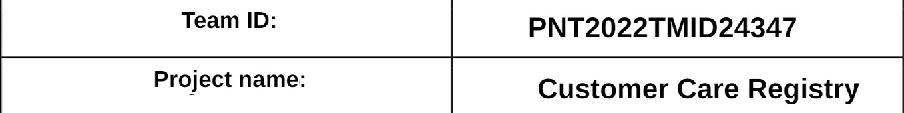

# SI-GuidedProject-53983-1663928165
Customer Complaint Registry using Cloud Technology

 * Team Id: PNT2022TMID24347

Overview:

📝 PROJECT DESCRIPTION: 

 * This Application has been developed to help the customer in processing their complaints. 
 
 * The customers can raise the ticket with a detailed description of the issue.
 
 * An Agent will be assigned to the Customer to solve the problem.
 
 * Whenever the agent is assigned to a customer they will be notified with an email alert. 
 
 * Customers can view the status of the ticket till the service is provided.

📒 ASSIGNMENT FINISHED: 

  1. ASSIGNMENT I ✅
 
  2. ASSIGNMENT II ✅
 
  3. ASSIGNMENT III ✅
 
  4. ASSIGNMENT IV ✅
  
 
 FINISHED TASKS:
 
 1. IDEATION ✅
 
 2. DESIGN-PHASE 1 ✅
 
 3. DESIGN PHASE 2 ✅

 4. PROJECT PLANNING ✅
 
 5. SPRINT 1 & 2 COMPLETED WITH BASIC WEBPAGE TEMPLATE CREATION ✅
 
 6. SPRINT 3 WITH IBM-DB2 INSTANCE & CONNECTION ✅
 
 7. SPRINT 4 WITH REFINED UI/UX AND DATABASE SCHEMAS AND CLOUD ✅
 
 8. FINAL DELIVERABLES WITH DEMO LINK & REPORT ✅

🧑🏻‍🦰 TEAM MEMBERS: 

 1. GOUTHAM K,

 2. SANJAY S,

 3. ROGITH M,

 4. SIVA SRIRAJ.
 
 
 

👨🏻‍💻 SOFTWARE REQUIRED: 

 * PYTHON,
 
 * FLASK,
 
 * DOCKER.
 
 
 
🈸 TECHNOLOGY: 

 * IBM CLOUD,
 
 * HTML	CSS,
 
 * PYTHON - FLASK,
 
 * KUBERNETES	DOCKER,
 
 * IBM CONTAINER REGISTRY	IBM CLOUD OBJECT	IBM DB2

 
 
